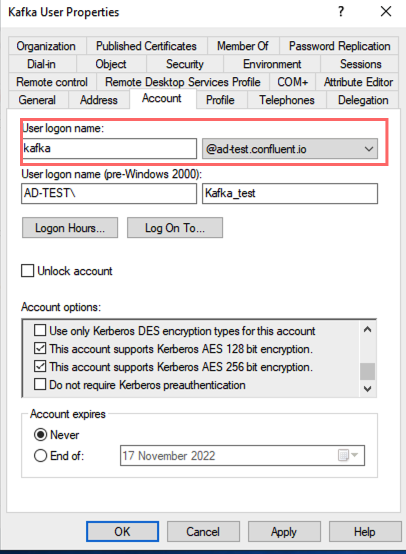

# LDAP Binding Test

Example use:

```bash
java -jar ldap-bind-test.jar ldap://your-ad-hostname:389 <aduser@realm> <aduser-password>
```
Your AD Username for binding can be confirmed by opening "Active Directory Users and Computers", navigating to your user and using the Account tab to get the full login name:



Full example:

```bash
java -jar ldap-bind-test.jar ldap://192.168.1.188:389 'Administrator@ad-test.confluent.io' '!YourPasswordHere'
LDAP URL: ldap://192.168.1.188:389
BIND DN: Administrator@ad-test.confluent.io
BIND PASSWORD: !YourPasswordHere
The LDAP bind was successful.
```
